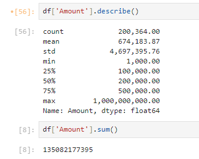
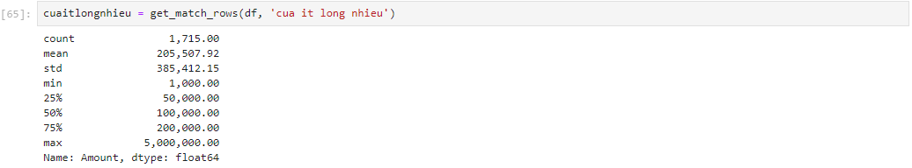
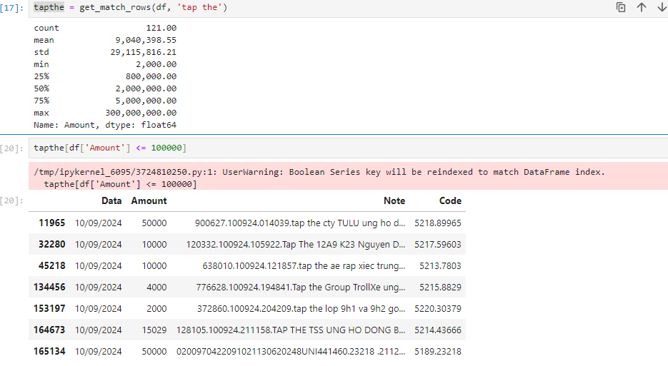
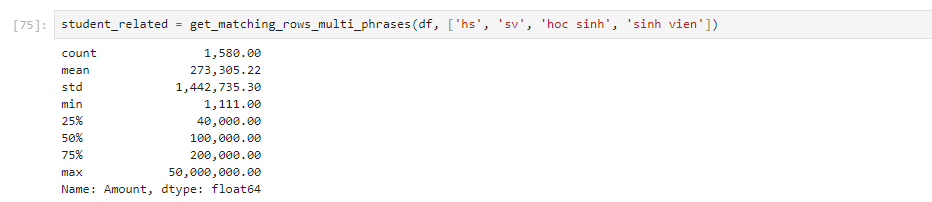
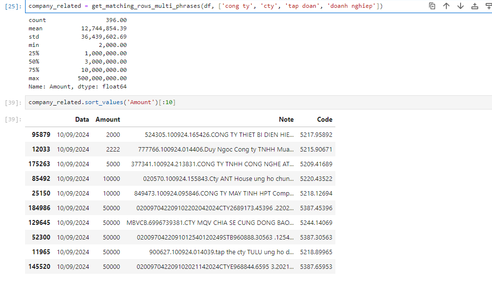

title: Một số insights từ file sao kê của Mặt trận Tổ Quốc Việt Nam
date: 2024-09-15
modified: 2024-09-15
tags: mttq, sao kê, insights
category: pymi.vn
slug: saoke
authors: tung491

Nhân dịp ngày hội check var phông bạt toàn quốc thứ 6 ngày 13/9/2024, một pymier rảnh rỗi đã ngồi vọc file sao kê từ MTTQ VN. Dưới đây là một số insights từ file sao kê đó.

## Tổng số tiền 

Với tổng 200,364 giao dịch trong 10 ngày từ 1-10/9/2024, tổng số tiền mà MTTQ VN nhận được là 135 tỷ đồng với trung bình mỗi giao dịch là 674,183 nghìn đồng và giao dịch có giá trị lớn nhất là 1 tỷ đồng.

## Số lượng giao dịch mỗi ngày

Bão Yagi đổ bộ vào đất liền Việt Nam vào ngày 7/9. Ta có thể thấy ngày hôm sau (8/9), số lượng giao dịch gửi vào MTTQ đã tăng đột biến gấp gần 10 lần với 503 giao dịch. Đáng kinh ngạc hơn nữa, ngày 9/9, số lượng giao dịch đã tăng lên hơn 6 ngàn giao dịch, gấp 12 lần ngày hôm trước. Và đến ngày 10/9, tổng số giao dịch trong ngày đã lên đến 191 nghìn giao dịch.

## Thống kê về một số patterns trong phần nội dung giao dịch

### Của ít lòng nhiều

Pattern "cua it long nhieu" xuất hiện trong 1715 giao dịch, với trung bình giá trị là 205 nghìn đồng, giá trị lớn nhất là 5 triệu đồng.

### Tập thể

Pattern gây sốt trong cộng đồng mạng là "tập thể" với 121 giao dịch, với trung bình giá trị là 9 triệu đồng, giá trị lớn nhất là 300 triệu đồng. Nhưng phần gây sốt là xuất hiện một số giao dịch của một số tổ chức tập thể với giá trị bé như 2 hay 10 nghìn đồng.

### Học sinh sinh viên

Dù là học sinh sinh viên đã đóng góp 1580 giao dịch, với giá trị trung bình 273 nghìn đồng và cao nhất là 50 triệu đồng.

### Các doanh nghiệp

Các doanh nghiệp đóng góp 396 giao dịch. Trung bình mỗi giao dịch là 12.7 triệu đồng và giao dịch có giá trị lớn nhất là 100 triệu đồng.

Jupyter Notebook được sử dụng có thể xem tại [đây](https://gist.github.com/tung491/fde52f83ca79fda886b24fb524cfae82). Link data tại [đây](https://docs.google.com/spreadsheets/d/1qEFjpatScpsf7znaVcrp3lFZpRtMJm5mMeMCVqN_38s/edit?usp=sharing)
Hết.
